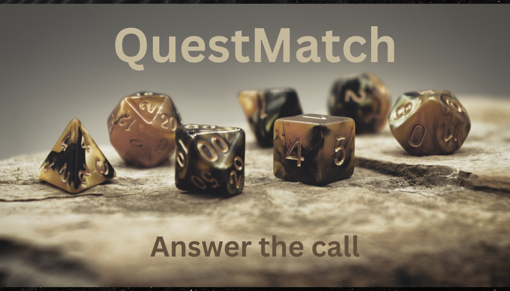

# QuestMatch
 &nbsp; &nbsp;

&nbsp;&nbsp;&nbsp;

    

[![Issues][issues-shield]][issues-url]
[![Contributors][contributors-shield]][contributors-url]

&nbsp;&nbsp;&nbsp;

Welcome to QuestMatch, an app that will be used to create matches for DnD(Dungeons and Dragons) campaigns.

> **Warning:** This app is under development and is not yet online. You can contribute to it and as soon as there is some development, I will upload it.

## Steps to use the app

### User registration

1. The user registers for an account(we will be using firebase authentication for that)
1. The user verifies his email and registers successfully
1. The user logs in, updates his profile and he can see other users based on their profile.(we will use firebase database to read and update the user profile)
    2. He can enter wether he wants to be a player, a DM or both.
    2. He can update his name, email, password etc.
1. The user sends messages to other users nd he can create a party for other people to join.
    2. He can also block and/or report users

### When the party is created:

1. When the party is created, next to each user there will be the role that each user has and different color based on the role.
    Suggestion:
    2. Red for the Dungeon Master
    2. Green for the players
2. There will be a group chat that will be used by the players to be able to contact with each other.

## Programming languages that will be used

This section should list any m?style=for-the-badgeajor frameworks/libraries used to bootstrap your project. Leave any add-ons/plugins for the acknowledgements section. Here are a few examples.

<!--* [![Next][Next.js]][Next-url]
* [![React][React.js]][React-url]
* [![Vue][Vue.js]][Vue-url]
* [![Angular][Angular.io]][Angular-url]
* [![Svelte][Svelte.dev]][Svelte-url]
* [![Laravel][Laravel.com]][Laravel-url]
* [![Bootstrap][Bootstrap.com]][Bootstrap-url]
* [![JQuery][JQuery.com]][JQuery-url]
-->

Since I will be using firebase to host the app, the front end will be madde using firebase hosting and the backend using firebase functions.

1. Back End:

&nbsp;&nbsp;&nbsp;&nbsp;&nbsp;&nbsp;&nbsp;&nbsp;
[![Node][Node.js]][Node-url]

Nodejs as this is the programming language formally suportd by Google to create firebase functions.

2. Front End:

&nbsp;&nbsp;&nbsp;&nbsp;&nbsp;&nbsp;&nbsp;&nbsp;
[![Vue][Vue.js]][Vue-url]

Vuejs as it is simple and can be used to create a real time application.

Please write clean code and insert comments so that other users can see what you have been doing and continue to improve the code.

## What features can you add?

You can basically add any feature you want. There are no limitations but you have to follow some very basic rules(no bad language of any kind etc.) Any new fat[forks-shield]: https://img.shields.io/github/forks/porfanid/QuestMatch.svg?style=for-the-badge
[forks-url]: https://github.com/porfanid/QuestMatch/network/members
[stars-shield]: https://img.shields.io/github/stars/porfanid/QuestMatch.svg?style=for-the-badge
[stars-url]: https://github.com/porfanid/QuestMatch/stargazers
ure, new design etc are welcome.

<!-- MARKDOWN LINKS & IMAGES -->
<!-- https://www.markdownguide.org/basic-syntax/#reference-style-links -->
[contributors-shield]: https://img.shields.io/github/contributors/porfanid/QuestMatch.svg?style=for-the-badge

[contributors-url]: https://github.com/porfanid/QuestMatch/graphs/contributors

[issues-shield]: https://img.shields.io/github/issues/porfanid/QuestMatch.svg?style=for-the-badge
[issues-url]: https://github.com/porfanid/QuestMatch/issues

[license-shield]: https://img.shields.io/github/license/porfanid/QuestMatch.svg?style=for-the-badge
[license-url]: https://github.com/porfanid/QuestMatch/blob/master/LICENSE.md

[Vue.js]: https://img.shields.io/badge/Vue.js-35495E?style=for-the-badge&logo=vuedotjs&logoColor=4FC08D
[Vue-url]: https://vuejs.org/

[Node.js]: https://img.shields.io/badge/Node.js-35495E?style=for-the-badge&logo=nodedotjs&logoColor=4FC08D
[Node-url]: https://nodejs.org/ 